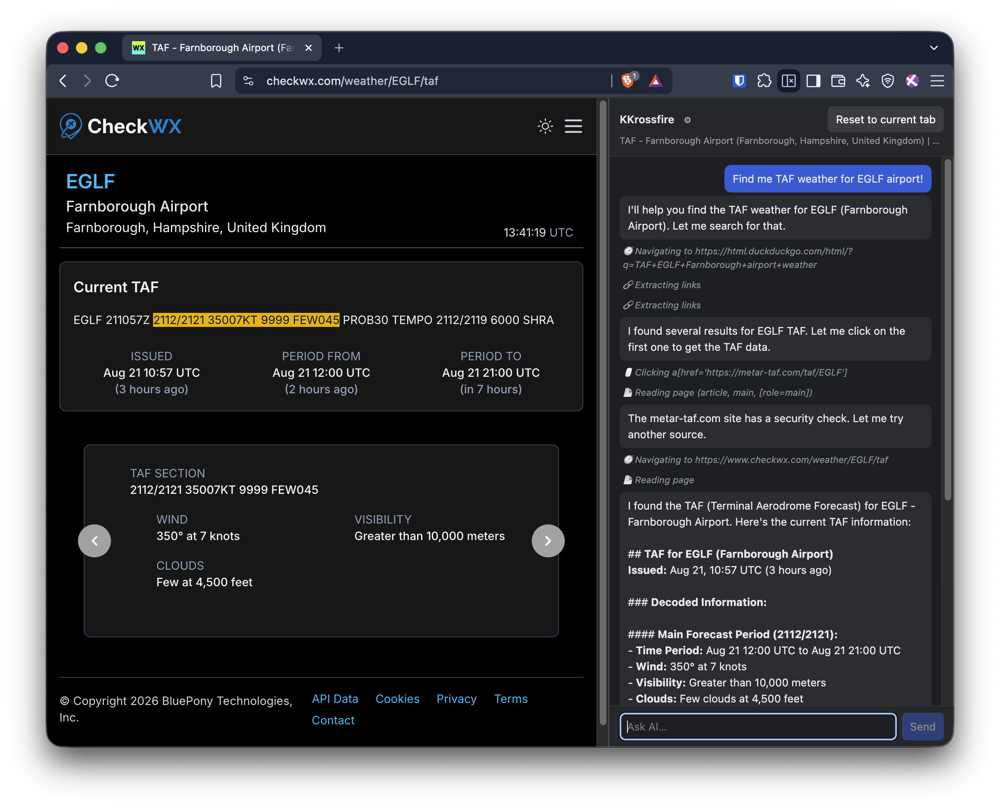

# KKrossfire

🧨 THIS IS EXTREMELY DANGEROUS. ONLY USE IF YOU KNOW WHAT YOU ARE DOING. 💥

A Chrome extension that gives AI full control (!) of a browser tab.

An AI that browses the web for you. Some use cases for the brave and brilliant:

- **Dig up information:** it is happy to go site-hopping for you.
- **Fill out forms for you**, but you better ask it not to submit automaticaly. These things are agressive 😅
- **Extract data from webpages:** it can run JS, it can examine and modify the DOM, attach event handlers, etc.
- **Write and run you SQL** in DuckDB UI 🦆 or [shell.duckdb.org](https://shell.duckdb.org/)
- **Program in python** in JupyterLab or Marimo 🐍
- **It has YOU** to solve CAPTCHAs, so nothing on the Internet can stop it! 

It is deliberately minimal. If you find any feature that can be removed, just ask!

Inspired by [badlogic's Sitegeist](https://github.com/badlogic/sitegeist), but simpler.

## Features:

- Minimal: **One** sidebar, **one** session, attached to **one** tab at once.
- Connects to any OpenAI compatible provider. Even local LLMs.
- Inside the session, it has memory of what pages it has visited and what did it read there.
- When you hit "Reset", it forgets everything.
- You can delete your messages, and continue from there with a new prompt.
- It can run any **debugger-level** JS inside the page context. This whole extension is _XSS-as-a-Service, on steroids._
- But it can't do things a browser extension can't do: it can't read your files, can't trigger your password manager (hopefully!), etc.

## Setup

1. Load the folder as an unpacked extension (`chrome://extensions` → Developer mode → **Load unpacked**).
2. Open the panel (toolbar icon, or `Ctrl+Shift+9` / `Cmd+Shift+9`). Reset and rebind to the current tab with `Ctrl+Shift+0` / `Cmd+Shift+0`.
3. Click the gear and paste any OpenAI-compatible API URL + KEY.

That's it. The model and API endpoint default to OpenRouter; point the endpoint at any OpenAI-compatible server if you prefer.

## Use

- Type what you want done. Hit **Send**.
- The AI pins the current tab as its workspace and does the legwork there — searches, opens pages, reads them.
- The final answer streams in as it's written; tool steps show as plain status lines.
- **Reset** starts a fresh conversation and rebinds the workspace to whichever tab is active (shortcut: `Ctrl+Shift+0` / `Cmd+Shift+0`).
- Hover a user message to delete it and everything after it; hover an assistant message to copy its Markdown.
- No history.

Web search isn't a special tool — the AI just browses. For text already in the open page, it can use `find_in_page`, which returns matching text and a CSS selector for where it was found. Tell it to "find the best noise-cancelling headphones under $200 and compare the top three" and it will.

## How it works

- **Two halves.** The side panel is pure UI. A background service worker runs the loop: call the LLM with tools → run the tool calls in the workspace tab → feed results back → repeat until the model answers.
- **Memory is the conversation.** Every page it read and every result is kept in the message history, so it can recall things across pages.
- **It can run code.** Tool calls can execute JavaScript in the tab via Chrome's debugger protocol, so it can fill forms, click around, and extract data — not just read text. The tool returns the value of the last expression (or an explicit `return`).
